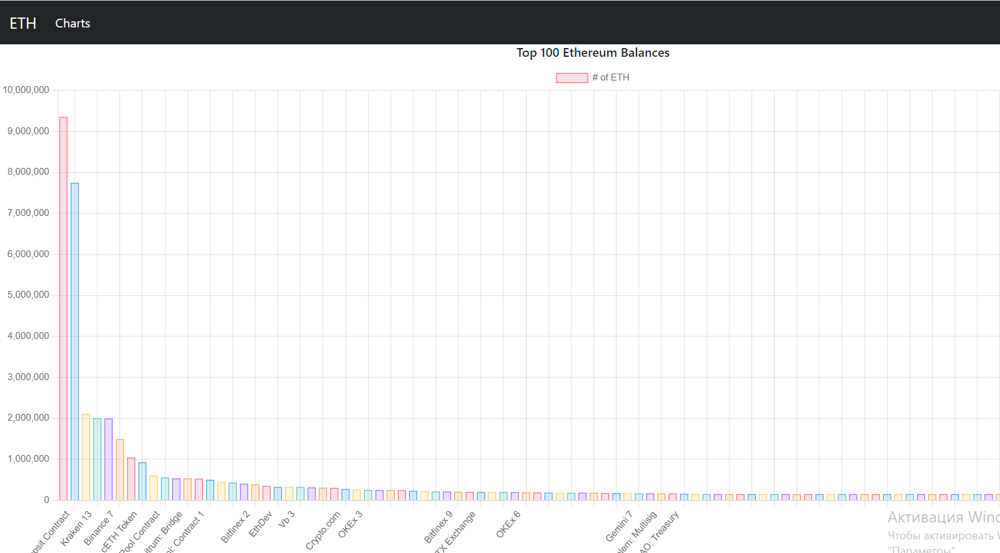
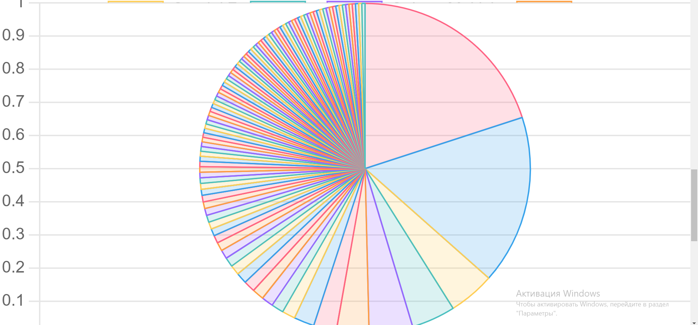
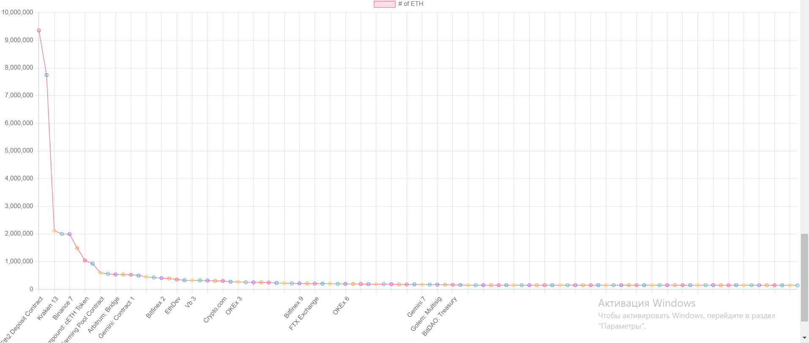

# The_Highest_100_ETH_accounts

## Installation
```bash
pip install requirements.txt
```
## Usage
 Application shows the highest 100 accounts in 3 types of charts(bar, pie, line) using Django and Chart.js. It uses account names as labels and balance as value for charts.
 ## Examples
 After running server, we can see 3 charts displaying 100 ETH balances and their accounts
#### Bar Chart 

#### Pie Chart

#### Line Chart

